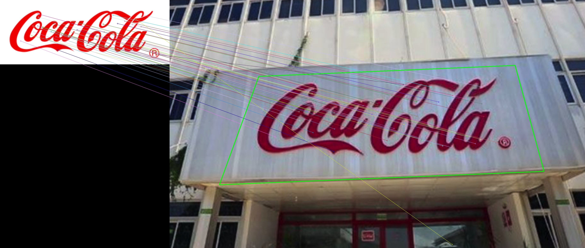
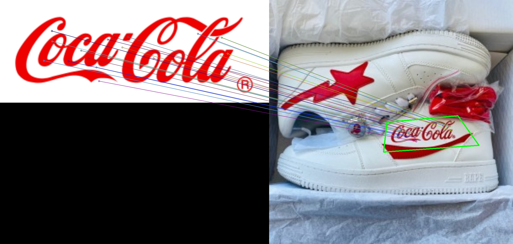
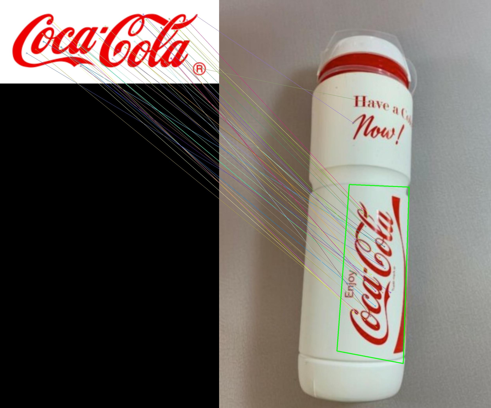
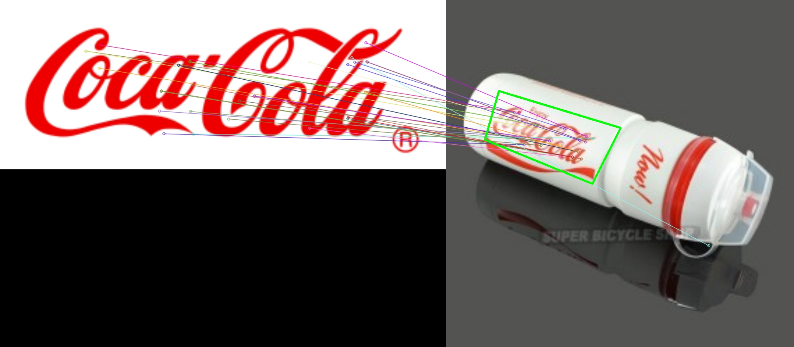
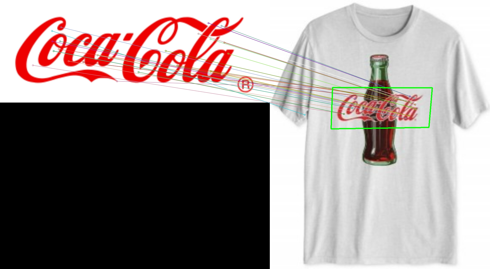
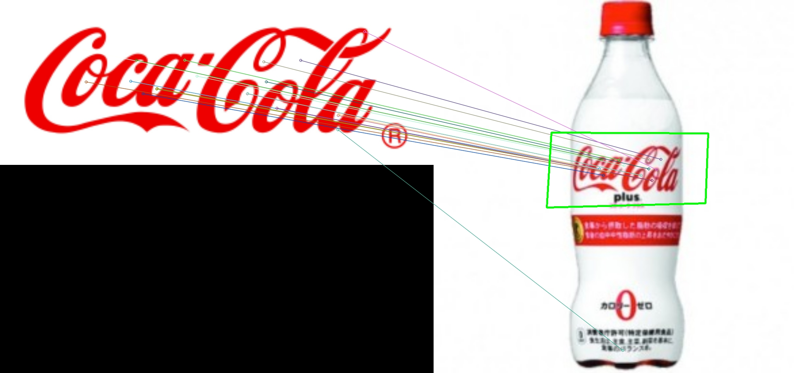
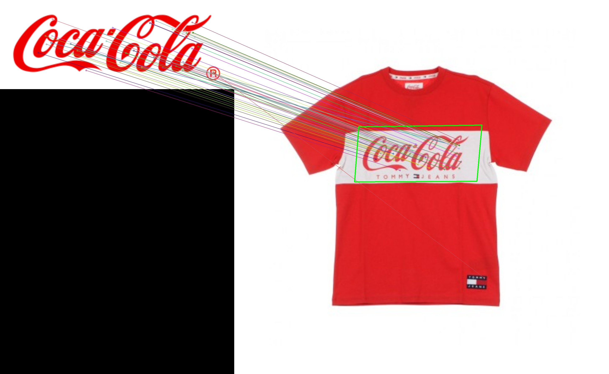

# SIFT + Homography to find a known object
要辨識影像中的物件有三個步驟，分別有：Keypoint detection、Feature extraction 以及 Feature matching。首先，在來源圖片A與目標圖片B分別找出 Keypoints，再依據各個 keypoints 取出其 local features。最後再將兩張圖片的 local features 進行 feature matching，計算並 match 各個距離最小的keypoint。

<table>
    <tbody>
        <tr>
            <td>
                
            </td>
            <td>
               
            </td>
            <td>
                
            </td>
        </tr>
        <tr>
            <td>
                
             </td>
             <td>
                
             </td>
             <td>
                
             </td>
        </tr>
        <tr>
            <td>
                
             </td>
             <td>
                
             </td>
             <td>
                
             </td>
        </tr>
    </tbody>
</table>

## 程式講講
以下程式碼使用 OpenCV 版本 4.5.1 並透過 OpenCV 的 java 介面實作。 
### 讀取照片
首先透過 `Bitmap` 進行圖片讀取，分別載入欲辨識的來源圖片(inputImage)以及目標比對的圖片(targetImage)。

```java
private Bitmap inputImage, targetImage; // make bitmap from image resource
inputImage = BitmapFactory.decodeResource(getResources(), R.drawable.coca_cola);
targetImage = BitmapFactory.decodeResource(getResources(), R.drawable.coca_cola_test1);
```

讀取完後我們將 Bitmap 影像轉換成 Mat 型態，Mat 是 OpenCV 中用於儲存影象資訊的型態。並將影像轉成灰階圖片才能進行 SIFT 的特徵點萃取。

```java
/***
 * Loading Image
 * source & target Image need converting color to grayscale */
// source
Mat imgObject = new Mat();
Utils.bitmapToMat(inputImage, imgObject);
Imgproc.cvtColor(imgObject, imgObject, Imgproc.COLOR_RGBA2GRAY);
// target
Mat imgScene = new Mat();
Utils.bitmapToMat(targetImage, imgScene);
// For output RGBA with target Image
Imgproc.cvtColor(imgScene, imgScene, Imgproc.COLOR_RGBA2GRAY);
```

### 偵測keypoints
我們使用 SIFT Detector 來取得影像中的 keypoints 分別存入 `keypointsObject` 和 `keypointsScene`。們取得了特徵點 keypoints 之後，接下來就要進行 Feature extraction。針對每個 keypoints 所提取出的特徵稱為 local features，並分別儲存在 `descriptorsObject` 和 `descriptorsScene`。此步驟的概念就是以 keypoints 為中心，取其周圍固定數目的像素點後予以量化，由於這些 keypoints 都是經過選擇後的，因此其周圍像素隱含著我們感興趣的元素，例如edges、corners、blob…等組成物件的架構，將這些區域予以量化後就能作為比對或學習該物件的特徵值。

```java
 /*** Step 1: Detect the keypoints using SIFT Detector, compute the descriptors */
SIFT sift = SIFT.create();
MatOfKeyPoint keypointsObject = new MatOfKeyPoint(), keypointsScene = new MatOfKeyPoint();
Mat descriptorsObject = new Mat(), descriptorsScene = new Mat();
sift.detectAndCompute(imgObject, new Mat(), keypointsObject, descriptorsObject);
sift.detectAndCompute(imgScene, new Mat(), keypointsScene, descriptorsScene);
```

> SIFT Descriptor的作法是針對每個keypoint取16×16大小的像素，再平均切為4×4的cells，每個cells取梯度及角度值統計為8個bins的Histogram，總共16個cells會得到16個histogram（8 bins），可合併成16×8=128維度的資料，最後針對這些資料進行L2-Normalizing，即可得到代表該keypoint的Feature vectors。
[參考](https://chtseng.wordpress.com/2017/05/22/圖像特徵比對二-特徵點描述及比對/)

## Feature matching 關鍵點配對
在取得影像的關鍵點(keypoints)以及其特徵向量(local features)後。我們就來處理 feature matching 尋找距離最近的相似點。`DescriptorMatcher.create()` 是用來建立一個執行特徵點匹配運算的實體。如果兩個特徵點的距離愈小，我們就認為它們愈近似。常見的方法有 BruteForce 使用的是 Euclidean distance 以及 FLANNBASED 使用快速近似最近鄰搜索算法。使用 KNN，從兩組 local features 中挑選兩兩最近似的成對放置為一組（K參數=2）。逐一取出已配對的 keypoints，若距離差異小於0.75倍(一般建議為0.7~0.8倍)，則認定為符合的關鍵點，放入 listOfGoodMatches 串列，此方式稱為 `David Lowe’s ratio test`，可排除掉不適合的 match。


```java
/***  Step 2: Matching descriptor vectors with a FLANN based matcher */
DescriptorMatcher matcher = DescriptorMatcher.create(DescriptorMatcher.FLANNBASED);
List<MatOfDMatch> knnMatches = new ArrayList<>();
matcher.knnMatch(descriptorsObject, descriptorsScene, knnMatches, 2);
//-- Filter matches using the Lowe's ratio test
float ratioThresh = 0.75f;
List<DMatch> listOfGoodMatches = new ArrayList<>();
for (int i = 0; i < knnMatches.size(); i++) {
    if (knnMatches.get(i).rows() > 1) {
        DMatch[] matches = knnMatches.get(i).toArray();
        if (matches[0].distance < ratioThresh * matches[1].distance) {
            listOfGoodMatches.add(matches[0]);
        }
    }
}
MatOfDMatch goodMatches = new MatOfDMatch();
goodMatches.fromList(listOfGoodMatches);
Log.e("GoodMatch",listOfGoodMatches.size() + " GoodMatch Found");
 ```

 ## 繪製相吻合關鍵點
 接下來就是要透過視覺化繪製出串列 `listOfGoodMatches` 中所有相似度高的關鍵點。除此之外透過計算 Homography，可以找出目標影像中欲辨識物體的位置並且將它框起來。此步驟就是將影像中的目標物利用方框標示出位置。

 ```java
 /*** Draw matches */
Utils.bitmapToMat(inputImage, imgObject);
Utils.bitmapToMat(targetImage, imgScene);
Mat imgMatches = new Mat();
Features2d.drawMatches(imgObject, keypointsObject, imgScene, keypointsScene, goodMatches, imgMatches, Scalar.all(-1),
        Scalar.all(-1), new MatOfByte(), Features2d.DrawMatchesFlags_NOT_DRAW_SINGLE_POINTS);
Imgproc.cvtColor(imgMatches, imgMatches, Imgproc.COLOR_RGBA2BGR);
//-- Localize the object
List<Point> obj = new ArrayList<>();
List<Point> scene = new ArrayList<>();
List<KeyPoint> listOfKeypointsObject = keypointsObject.toList();
List<KeyPoint> listOfKeypointsScene = keypointsScene.toList();
for (int i = 0; i < listOfGoodMatches.size(); i++) {
    //-- Get the keypoints from the good matches
    obj.add(listOfKeypointsObject.get(listOfGoodMatches.get(i).queryIdx).pt);
    scene.add(listOfKeypointsScene.get(listOfGoodMatches.get(i).trainIdx).pt);
}
MatOfPoint2f objMat = new MatOfPoint2f(), sceneMat = new MatOfPoint2f();
objMat.fromList(obj);
sceneMat.fromList(scene);
double ransacReprojThreshold = 3.0;
Mat H = Calib3d.findHomography( objMat, sceneMat, Calib3d.RANSAC, ransacReprojThreshold );
//-- Get the corners from the image_1 ( the object to be "detected" )
Mat objCorners = new Mat(4, 1, CvType.CV_32FC2), sceneCorners = new Mat();
float[] objCornersData = new float[(int) (objCorners.total() * objCorners.channels())];
objCorners.get(0, 0, objCornersData);
objCornersData[0] = 0;
objCornersData[1] = 0;
objCornersData[2] = imgObject.cols();
objCornersData[3] = 0;
objCornersData[4] = imgObject.cols();
objCornersData[5] = imgObject.rows();
objCornersData[6] = 0;
objCornersData[7] = imgObject.rows();
objCorners.put(0, 0, objCornersData);
Core.perspectiveTransform(objCorners, sceneCorners, H);
float[] sceneCornersData = new float[(int) (sceneCorners.total() * sceneCorners.channels())];
sceneCorners.get(0, 0, sceneCornersData);
//-- Draw lines between the corners (the mapped object in the scene - image_2 )
Imgproc.line(imgMatches, new Point(sceneCornersData[0] + imgObject.cols(), sceneCornersData[1]),
        new Point(sceneCornersData[2] + imgObject.cols(), sceneCornersData[3]), new Scalar(0, 255, 0), 4);
Imgproc.line(imgMatches, new Point(sceneCornersData[2] + imgObject.cols(), sceneCornersData[3]),
        new Point(sceneCornersData[4] + imgObject.cols(), sceneCornersData[5]), new Scalar(0, 255, 0), 4);
Imgproc.line(imgMatches, new Point(sceneCornersData[4] + imgObject.cols(), sceneCornersData[5]),
        new Point(sceneCornersData[6] + imgObject.cols(), sceneCornersData[7]), new Scalar(0, 255, 0), 4);
Imgproc.line(imgMatches, new Point(sceneCornersData[6] + imgObject.cols(), sceneCornersData[7]),
        new Point(sceneCornersData[0] + imgObject.cols(), sceneCornersData[1]), new Scalar(0, 255, 0), 4);

Bitmap bitmap=Bitmap.createBitmap(imgMatches.cols(), imgMatches.rows(), Bitmap.Config.ARGB_4444);
Imgproc.cvtColor(imgMatches, imgMatches, Imgproc.COLOR_RGBA2BGR);
Utils.matToBitmap(imgMatches, bitmap);
imageView.setImageBitmap(bitmap);
```

## Reference
- [Features2D + Homography to find a known object](https://docs.opencv.org/4.5.1/d7/dff/tutorial_feature_homography.html)
- [圖像特徵比對(一)-取得影像的特徵點](https://chtseng.wordpress.com/2017/05/06/圖像特徵比對一-取得影像的特徵點/)
- [圖像特徵比對(二)-特徵點描述及比對](https://chtseng.wordpress.com/2017/05/22/圖像特徵比對二-特徵點描述及比對/)